# Solution Architecture — UM Claims Analytics

> High-level architecture for the UPMC Utilization Management Claims Analytics platform.
> Two deployment approaches are defined: a **POC** for rapid insights and a **Production** hardened deployment.

---

## Approach A — POC

The POC approach is to derive insights with minimal infrastructure. A **solution architect** uses **VSCode with GitHub Copilot (Claude Opus 4.6, fast mode)** on a **VM** (accessed through Azure Bastion). The Copilot-assisted workflow joins **de-identified** claims data with policy CPT codes from the Fabric Lakehouse, then calls a **language model hosted in Azure AI Foundry (e.g. GPT-5.2-chat)** to summarize and analyze the CPT-code linkages — identifying anomalies, generating plain-language explanations, and producing flag recommendations. Output is consumed as **Markdown reports and JSON files**. No AKS or Power BI is required at this stage.

> **No PHI.** All claims data extracted from Snowflake is **de-identified before leaving Snowflake**. No Protected Health Information (PHI) is present in the Fabric Lakehouse, the VM, the LLM prompts, or any analytics output. This was agreed with the customer as a non-negotiable boundary.

### POC Architecture Diagram

```mermaid
---
config:
  theme: base
  themeVariables:
    fontSize: 24px
    background: "#FFFFFF"
    primaryColor: "#FFFFFF"
    primaryTextColor: "#000000"
    primaryBorderColor: "#000000"
    secondaryColor: "#FFFFFF"
    secondaryTextColor: "#000000"
    secondaryBorderColor: "#000000"
    tertiaryColor: "#FFFFFF"
    tertiaryTextColor: "#000000"
    tertiaryBorderColor: "#000000"
    lineColor: "#FFFFFF"
    textColor: "#000000"
    mainBkg: "#FFFFFF"
    nodeBorder: "#000000"
    clusterBkg: "#FFFFFF"
    clusterBorder: "#000000"
    titleColor: "#000000"
    noteTextColor: "#000000"
    noteBkgColor: "#FFFFFF"
    noteBorderColor: "#000000"
---
graph LR

    %% ───────────────────────────────────────────
    %% POLICY DATA — Left
    %% ───────────────────────────────────────────
    subgraph POLICY_SOURCE["Policy Source"]
        direction TB
        UPMC_POLICIES["🌐 UPMC Health Plan<br/>Policies & Procedures"]
    end

    subgraph POLICY_INGESTION["Policy Ingestion Pipeline"]
        direction TB
        STORAGE["📦 Azure Storage Account<br/><i>Raw policy documents</i>"]
        FOUNDRY_EMBED["🤖 Azure AI Foundry<br/><b>text-embedding-3</b>"]
        FOUNDRY_IQ["🧠 FoundryIQ<br/><i>Knowledge index</i>"]
        POLICY_JSON["📋 Structured JSON<br/><i>Parsed policy data</i>"]
        STORAGE -.->|optional| FOUNDRY_EMBED -.-> FOUNDRY_IQ
        STORAGE --> POLICY_JSON
    end

    subgraph POLICY_RAG["Policy RAG (Optional)"]
        direction TB
        FOUNDRY_IQ_READ["🔍 FoundryIQ<br/><i>Semantic retrieval</i>"]
    end

    %% ───────────────────────────────────────────
    %% CLAIMS DATA — Right
    %% ───────────────────────────────────────────
    subgraph CLAIMS_SOURCE["Claims Source"]
        direction TB
        SNOWFLAKE["❄️ Snowflake<br/><i>De-identified extract · No PHI</i>"]
    end

    subgraph CLAIMS_MOVEMENT["Claims Data Movement (No PHI)"]
        direction TB
        ONELAKE["🔗 OneLake Shortcut<br/><i>Option A: Snowflake interop (GA)</i>"]
        ADF["🔄 Azure Data Factory<br/><i>Option B: ADF Pipeline</i>"]
        ADLS["📦 ADLS Gen2<br/><i>Staging for Fabric shortcut</i>"]
        ADF --> ADLS
    end

    subgraph CLAIMS_FABRIC["Microsoft Fabric"]
        direction TB
        FABRIC_LAKEHOUSE["🏠 Fabric Lakehouse<br/><i>De-identified Claims + Policy JSON<br/>+ UM Insights & Flags</i>"]
    end

    %% ───────────────────────────────────────────
    %% LLM — Azure AI Foundry
    %% ───────────────────────────────────────────
    subgraph LLM_SERVICE["Azure AI Foundry"]
        direction TB
        GPT["🧠 GPT-5.2-chat<br/><i>temperature=0 · seed pinned<br/>Summarise CPT-code joins<br/>Anomaly explanations</i>"]
    end

    %% ───────────────────────────────────────────
    %% COMPUTE — Center (VM for POC)
    %% ───────────────────────────────────────────
    subgraph ACCESS["Secure Access"]
        direction TB
        BASTION["🔒 Azure Bastion"]
        VM["🖥️ Azure VM<br/><i>Solution Architect uses<br/>VSCode + GitHub Copilot<br/>(Claude Opus 4.6, fast mode)<br/>User Managed Identity</i>"]
        BASTION --> VM
    end

    %% ───────────────────────────────────────────
    %% OUTPUT
    %% ───────────────────────────────────────────
    subgraph OUTPUT["POC Outputs"]
        direction TB
        CLI_REPORTS["📄 Markdown Reports"]
        CLI_FLAGS["🚩 JSON Flags & Alerts"]
    end

    %% ───────────────────────────────────────────
    %% FLOWS
    %% ───────────────────────────────────────────
    UPMC_POLICIES -->|"Crawl &<br/>download"| STORAGE
    POLICY_JSON -->|"Structured JSON"| FABRIC_LAKEHOUSE
    FOUNDRY_IQ -.->|"Indexed<br/>knowledge"| FOUNDRY_IQ_READ
    FOUNDRY_IQ_READ -.->|"Policy context<br/>(optional)"| VM
    SNOWFLAKE -->|"Option A:<br/>De-identified claims<br/>OneLake interop"| ONELAKE
    SNOWFLAKE -->|"Option B:<br/>De-identified claims<br/>ADF pipeline"| ADF
    ONELAKE -->|"Shortcut"| FABRIC_LAKEHOUSE
    ADLS -->|"Shortcut"| FABRIC_LAKEHOUSE
    FABRIC_LAKEHOUSE -->|"De-identified claims<br/>+ policy data"| VM
    VM -->|"CPT join results<br/>→ LLM summarisation"| GPT
    GPT -->|"Summaries &<br/>flag recommendations"| VM
    VM -->|"Write UM insights,<br/>flags & alerts"| FABRIC_LAKEHOUSE
    VM --> OUTPUT

    %% Styling
    classDef default fill:#FFFFFF,stroke:#000000,color:#000000,stroke-width:2px
    classDef optionalDashed fill:#FFFFFF,stroke:#000000,color:#000000,stroke-width:2px,stroke-dasharray:5 5

    class VM,STORAGE,POLICY_JSON,ADLS,ONELAKE,FABRIC_LAKEHOUSE,SNOWFLAKE,CLI_REPORTS,CLI_FLAGS,UPMC_POLICIES,BASTION,ADF,GPT,FOUNDRY_EMBED,FOUNDRY_IQ,FOUNDRY_IQ_READ default
    class FOUNDRY_EMBED,FOUNDRY_IQ,FOUNDRY_IQ_READ optionalDashed

    %% Subgraph backgrounds
    style POLICY_SOURCE fill:#FFFFFF,stroke:#000000,color:#000000
    style POLICY_INGESTION fill:#FFFFFF,stroke:#000000,color:#000000
    style POLICY_RAG fill:#FFFFFF,stroke:#000000,stroke-dasharray:5 5,color:#000000
    style CLAIMS_SOURCE fill:#FFFFFF,stroke:#000000,color:#000000
    style CLAIMS_MOVEMENT fill:#FFFFFF,stroke:#000000,color:#000000
    style CLAIMS_FABRIC fill:#FFFFFF,stroke:#000000,color:#000000
    style LLM_SERVICE fill:#FFFFFF,stroke:#000000,color:#000000
    style ACCESS fill:#FFFFFF,stroke:#000000,color:#000000
    style OUTPUT fill:#FFFFFF,stroke:#000000,color:#000000
```



### POC Characteristics

| Aspect | Detail |
|---|---|
| **Compute** | Single Azure VM accessed via **Azure Bastion** (no public IP on the VM). |
| **Identity** | **User Managed Identity** assigned to the VM; used for authenticating to Storage, Foundry, Fabric, and Foundry LLM endpoints. |
| **Pipeline execution** | A **solution architect** uses **VSCode with GitHub Copilot (Claude Opus 4.6, fast mode)** on the VM to run the `um-claims run-all` pipeline. The script reads **de-identified** claims and structured policy data from the Fabric Lakehouse, joins them on CPT codes, and sends the join results to **Azure AI Foundry (GPT-5.2-chat)** for summarisation — producing anomaly explanations, plain-language findings, and flag recommendations. Results are **written back to the Fabric Lakehouse** (UM insights, flags, and alerts tables) so they can be reported on, in addition to local Markdown/JSON output files. |
| **LLM role** | **GPT-5.2-chat** (Azure AI Foundry) is called by the Python script to summarise and interpret CPT-code linkages between de-identified claims and policy data. The model generates human-readable explanations that the solution architect reviews. **No PHI is sent to the LLM.** |
| **LLM determinism** | All Foundry LLM calls enforce **`temperature=0`** and a **fixed `seed`** parameter so that LLM summaries do not vary across runs. This aligns with the project's determinism and reproducibility requirement. |
| **Data privacy** | All claims data is **de-identified in Snowflake before extraction**. No PHI is present in the Lakehouse, on the VM, in LLM prompts, or in any output artefact. |
| **Networking** | VM sits in a VNet; Bastion provides secure RDP/SSH without exposing the VM to the internet. |

---

## Approach B — Production

Production upgrades the POC by replacing the manual Copilot-assisted workflow with an **AKS-hosted Python FastAPI application** that serves as the automated agent. The FastAPI agents perform the same CPT-code join analysis and LLM-powered summarisation that the solution architect does by hand in the POC — but continuously, at scale, and exposed via API. The architecture adds **F5 load balancer** in front of AKS, **private networking** across all services, and **Power BI dashboards** for output. The VM/Bastion pair is retained for administrative access and ad-hoc troubleshooting.

> **No PHI.** The same de-identification constraint applies in Production: all claims data extracted from Snowflake is de-identified at source. No PHI enters the Fabric Lakehouse, AKS, the LLM, or any downstream output.

### Production Architecture Diagram

```mermaid
---
config:
  theme: base
  themeVariables:
    fontSize: 24px
    background: "#FFFFFF"
    primaryColor: "#FFFFFF"
    primaryTextColor: "#000000"
    primaryBorderColor: "#000000"
    secondaryColor: "#FFFFFF"
    secondaryTextColor: "#000000"
    secondaryBorderColor: "#000000"
    tertiaryColor: "#FFFFFF"
    tertiaryTextColor: "#000000"
    tertiaryBorderColor: "#000000"
    lineColor: "#FFFFFF"
    textColor: "#000000"
    mainBkg: "#FFFFFF"
    nodeBorder: "#000000"
    clusterBkg: "#FFFFFF"
    clusterBorder: "#000000"
    titleColor: "#000000"
    noteTextColor: "#000000"
    noteBkgColor: "#FFFFFF"
    noteBorderColor: "#000000"
---
graph LR

    %% ───────────────────────────────────────────
    %% POLICY DATA — Left
    %% ───────────────────────────────────────────
    subgraph POLICY_SOURCE["Policy Sources (Production)"]
        direction TB
        UPMC_POLICIES["🌐 UPMC Health Plan<br/>Policies & Procedures"]
        ALT_POLICIES["🌐 Additional Public Policy Sites<br/><i>CMS · State Medicaid · Other Payers</i>"]
    end

    subgraph POLICY_INGESTION["Policy Ingestion Pipeline"]
        direction TB
        STORAGE["📦 Azure Storage Account<br/><i>Private Endpoint</i>"]
        FOUNDRY_EMBED["🤖 Azure AI Foundry<br/><b>text-embedding-3</b>"]
        FOUNDRY_IQ["🧠 FoundryIQ<br/><i>Knowledge index</i>"]
        POLICY_JSON["📋 Structured JSON<br/><i>Parsed policy data</i>"]
        STORAGE -.->|optional| FOUNDRY_EMBED -.-> FOUNDRY_IQ
        STORAGE --> POLICY_JSON
    end

    subgraph POLICY_RAG["Policy RAG (Optional)"]
        direction TB
        FOUNDRY_IQ_READ["🔍 FoundryIQ<br/><i>Semantic retrieval</i>"]
    end

    %% ───────────────────────────────────────────
    %% CLAIMS DATA — Right
    %% ───────────────────────────────────────────
    subgraph CLAIMS_SOURCE["Claims Source"]
        direction TB
        SNOWFLAKE["❄️ Snowflake<br/><i>De-identified extract · No PHI</i>"]
    end

    subgraph CLAIMS_MOVEMENT["Claims Data Movement (No PHI)"]
        direction TB
        ONELAKE["🔗 OneLake Shortcut<br/><i>Option A: Snowflake interop (GA)</i>"]
        ADF["🔄 Azure Data Factory<br/><i>Option B: ADF Pipeline</i>"]
        ADLS["📦 ADLS Gen2<br/><i>Staging for Fabric shortcut</i>"]
        ADF --> ADLS
    end

    subgraph CLAIMS_FABRIC["Microsoft Fabric"]
        direction TB
        FABRIC_LAKEHOUSE["🏠 Fabric Lakehouse<br/><i>De-identified Claims + Policy JSON<br/>+ UM Insights & Flags</i>"]
    end

    %% ───────────────────────────────────────────
    %% LLM — Azure AI Foundry
    %% ───────────────────────────────────────────
    subgraph LLM_SERVICE["Azure AI Foundry"]
        direction TB
        GPT["🧠 GPT-5.2-chat<br/><i>temperature=0 · seed pinned<br/>Summarise CPT-code joins<br/>Anomaly explanations</i>"]
    end

    %% ───────────────────────────────────────────
    %% ADMIN ACCESS — VM/Bastion
    %% ───────────────────────────────────────────
    subgraph ADMIN_ACCESS["Admin Access"]
        direction TB
        BASTION["🔒 Azure Bastion"]
        VM["🖥️ Azure VM<br/><i>Admin & troubleshooting<br/>User Managed Identity</i>"]
        BASTION --> VM
    end

    %% ───────────────────────────────────────────
    %% CONTROL PLANE — Center
    %% ───────────────────────────────────────────
    subgraph NETWORK["Private Network"]
        direction TB
        F5["⚖️ F5 Load Balancer<br/><i>TLS termination</i>"]
        subgraph CONTROL_PLANE["Azure Agents Control Plane"]
            direction TB
            AKS["☸️ AKS (Private Cluster)<br/><i>User Managed Identity</i>"]
            ORCHESTRATOR["🔄 Agent Orchestrator"]
            UM_AGENTS["📋 UM Analytics Agents<br/><i>Python FastAPI · Detection<br/>Policy Sim · Appeals · Benchmarking</i>"]
            AKS --> ORCHESTRATOR --> UM_AGENTS
        end
        F5 --> AKS
    end

    %% ───────────────────────────────────────────
    %% OUTPUT
    %% ───────────────────────────────────────────
    subgraph OUTPUT["Production Outputs"]
        direction TB
        POWERBI["📊 Power BI Dashboards"]
        FLAGS["🚩 Flags & Alerts"]
        RECOMMENDATIONS["💡 Policy Recommendations"]
    end

    %% ───────────────────────────────────────────
    %% FLOWS
    %% ───────────────────────────────────────────
    UPMC_POLICIES -->|"Crawl &<br/>download"| STORAGE
    ALT_POLICIES -->|"Crawl &<br/>download"| STORAGE
    POLICY_JSON -->|"Structured JSON<br/>(Private Link)"| FABRIC_LAKEHOUSE
    FOUNDRY_IQ -.->|"Indexed<br/>knowledge"| FOUNDRY_IQ_READ
    FOUNDRY_IQ_READ -.->|"Policy context<br/>(optional)"| F5
    SNOWFLAKE -->|"Option A:<br/>De-identified claims<br/>OneLake interop"| ONELAKE
    SNOWFLAKE -->|"Option B:<br/>De-identified claims<br/>ADF pipeline"| ADF
    ONELAKE -->|"Shortcut"| FABRIC_LAKEHOUSE
    ADLS -->|"Shortcut"| FABRIC_LAKEHOUSE
    FABRIC_LAKEHOUSE -->|"De-identified claims<br/>+ policy data<br/>(Private Link)"| F5
    UM_AGENTS -->|"CPT join results<br/>→ LLM summarisation"| GPT
    GPT -->|"Summaries &<br/>flag recommendations"| UM_AGENTS
    UM_AGENTS -->|"Write UM insights,<br/>flags & alerts<br/>(Private Link)"| FABRIC_LAKEHOUSE
    VM -.->|"Admin<br/>access"| AKS
    CONTROL_PLANE --> OUTPUT
    FABRIC_LAKEHOUSE -->|"DirectLake"| POWERBI

    %% Styling
    classDef default fill:#FFFFFF,stroke:#000000,color:#000000,stroke-width:2px
    classDef optionalDashed fill:#FFFFFF,stroke:#000000,color:#000000,stroke-width:2px,stroke-dasharray:5 5

    class AKS,ORCHESTRATOR,UM_AGENTS,STORAGE,POLICY_JSON,VM,ADLS,ONELAKE,FABRIC_LAKEHOUSE,SNOWFLAKE,POWERBI,FLAGS,RECOMMENDATIONS,UPMC_POLICIES,ALT_POLICIES,BASTION,F5,ADF,GPT default
    class FOUNDRY_EMBED,FOUNDRY_IQ,FOUNDRY_IQ_READ optionalDashed

    %% Subgraph backgrounds
    style POLICY_SOURCE fill:#FFFFFF,stroke:#000000,color:#000000
    style POLICY_INGESTION fill:#FFFFFF,stroke:#000000,color:#000000
    style POLICY_RAG fill:#FFFFFF,stroke:#000000,stroke-dasharray:5 5,color:#000000
    style CLAIMS_SOURCE fill:#FFFFFF,stroke:#000000,color:#000000
    style CLAIMS_MOVEMENT fill:#FFFFFF,stroke:#000000,color:#000000
    style CLAIMS_FABRIC fill:#FFFFFF,stroke:#000000,color:#000000
    style LLM_SERVICE fill:#FFFFFF,stroke:#000000,color:#000000
    style ADMIN_ACCESS fill:#FFFFFF,stroke:#000000,color:#000000
    style NETWORK fill:#FFFFFF,stroke:#000000,color:#000000
    style CONTROL_PLANE fill:#FFFFFF,stroke:#000000,color:#000000
    style OUTPUT fill:#FFFFFF,stroke:#000000,color:#000000
```



### Production Characteristics

| Aspect | Detail |
|---|---|
| **Compute** | **AKS private cluster** running the [Azure Agents Control Plane](https://github.com/microsoft/azure-agents-control-plane/). VM/Bastion retained for admin access. |
| **Agent runtime** | **Python FastAPI application** deployed as pods on AKS. The FastAPI agents automate the same CPT-code join analysis and **GPT-5.2-chat summarisation** that the solution architect performs manually in the POC — running continuously, at scale, and exposed via REST API. All input data is de-identified; **no PHI enters the agents or the LLM**. Results (UM insights, flags, alerts) are **written back to the Fabric Lakehouse** for Power BI reporting. |
| **LLM determinism** | All Foundry LLM calls enforce **`temperature=0`** and a **fixed `seed`** parameter. Summaries are reproducible across runs given the same input data. |
| **Load Balancing** | **F5** sits in front of AKS providing TLS termination and traffic management. |
| **Identity** | **User Managed Identity** on both AKS and the VM; used for all Azure service authentication (Storage, Foundry, Fabric, Key Vault). No service-principal secrets stored. |
| **Private Networking** | All services communicate over **Private Endpoints / Private Link** within a hub-spoke VNet topology. AKS API server is private. No public ingress except through F5. |
| **Outputs** | **Power BI dashboards** replace local reports; flags and recommendations are surfaced via API and Power BI. |

---

## 1. Policy Data — Ingestion & Query

### Source

UPMC Health Plan publishes clinical and administrative policies at:

<https://www.upmchealthplan.com/providers/medical/resources/manuals/policies-procedures>

In the **POC**, only the UPMC policy site above is targeted. In **Production**, the ingestion pipeline extends to crawl **additional public policy sites** (e.g. CMS.gov national coverage determinations, state Medicaid bulletins, other payer-published medical policies) to enrich the CPT-code linkage analysis with broader industry context.

### Ingestion Pipeline (write path)

| Component | Role |
|---|---|
| **Azure Storage Account** | Stores raw policy documents (PDF/HTML) after crawling from the UPMC policy site (POC) or multiple public policy sites (Production). In Production, accessed only via Private Endpoint. |
| **Azure AI Foundry — `text-embedding-3`** *(optional)* | Generates dense vector embeddings for each policy chunk, enabling semantic similarity search. Only needed if policy RAG is enabled. |
| **FoundryIQ** *(optional)* | Builds and maintains the knowledge index over the embedded policy corpus. Only needed if policy RAG is enabled. |
| **Structured JSON → Fabric Lakehouse** | The ingestion pipeline parses policy documents into structured JSON (policy metadata, rules, criteria, CPT/ICD linkages) and writes them to the **OneLake Fabric Lakehouse**. This co-locates policy data alongside claims data in a single unified store. |

> **Design decision — structured JSON is the primary path.** The ingestion pipeline parses each policy document into structured JSON and stores it in the Fabric Lakehouse via OneLake. This co-locates policy data alongside claims data in a single store, queryable by the VM (POC), AKS agents (Production), and Power BI (via DirectLake).

> **Design decision — policy RAG is optional.** The embedding/indexing path through Azure AI Foundry and FoundryIQ is available but not required for the core UM analytics pipeline. It adds value only when free-form natural-language Q&A over unstructured policy prose is needed. The structured JSON in the Lakehouse is sufficient for deterministic rule-matching and policy metadata lookups.

> **⚠️ Assumption — PDF parsing is sufficient for CPT-code extraction.** The current ingestion pipeline assumes that standard PDF text extraction is adequate to extract CPT codes, procedure descriptions, and policy criteria from published policy documents. If PDF layouts grow in complexity (e.g. multi-column layouts, scanned images, embedded tables with complex formatting), additional tooling may be required — for example, **Azure AI Document Intelligence** (formerly Form Recognizer), **OCR**, or **Azure AI Content Understanding** — to reliably extract structured data from these documents.

### Query Service (read path)

The **Fabric Lakehouse** is the primary query surface. The VM (POC) or AKS agents (Production) query structured policy JSON and claims data directly from the Lakehouse. Power BI connects to the same Lakehouse via **DirectLake mode** for interactive dashboards.

*Optionally*, FoundryIQ can serve a semantic retrieval interface for free-form policy Q&A, using the same `text-embedding-3` model to embed queries against the pre-built index.

---

## 2. Claims Data — Snowflake → Microsoft Fabric

### Source

Claims data resides in **Snowflake**, the existing enterprise data warehouse.

> **⚠️ No PHI — Customer-Agreed Boundary.** All claims data extracted from Snowflake is **de-identified before it leaves Snowflake**. The Snowflake team is responsible for applying de-identification (removal or hashing of all HIPAA-defined identifiers) at the extraction boundary. No Protected Health Information (PHI) is present in OneLake, ADLS Gen2, the Fabric Lakehouse, compute layers (VM / AKS), Foundry LLM prompts, or any analytics output. This constraint was agreed with the customer and applies to both POC and Production.

### Data Movement Options

There are two options for landing de-identified Snowflake claims data in the Fabric Lakehouse. **Option A is preferred**; Option B is the fallback if the Snowflake team cannot deliver the required configuration in time.

#### Option A — OneLake ↔ Snowflake Interoperability (Preferred)

Microsoft OneLake and Snowflake interoperability is **now generally available**, enabling seamless cross-platform data access without data duplication:

- **OneLake shortcuts** allow Fabric to read Snowflake-managed Iceberg tables directly.
- Snowflake can query data stored in OneLake via external tables.
- No ETL copy required — both platforms operate on the same underlying data in open formats.

> **Reference:** [Microsoft OneLake and Snowflake Interoperability is Now Generally Available](https://blog.fabric.microsoft.com/en-US/blog/microsoft-onelake-and-snowflake-interoperability-is-now-generally-available)
>
> See also the FY26 co-sell guidance: *Snowflake + Microsoft Fabric: FY26 Co-Sell in Action*.

**Snowflake team prerequisites:**

- **De-identify claims data** — strip or hash all HIPAA-defined identifiers before writing to OneLake (this is the extraction boundary for the no-PHI guarantee)
- Create a service principal for OneLake access
- Configure an external table pointing to OneLake
- Write the de-identified database / tables to OneLake as Iceberg

> **Next step:** Have the UPMC Snowflake team / representative vet out that they are capable of performing the tasks identified in the [Snowflake ↔ OneLake integration guide](https://blog.fabric.microsoft.com/en-US/blog/microsoft-onelake-and-snowflake-interoperability-is-now-generally-available) (create a service principal, an external table, write the database to OneLake, etc.).

#### Option B — ADF Pipeline → ADLS Gen2 → Fabric Shortcut (Fallback)

If the Snowflake team cannot act on Option A within the POC timeline, the fallback is to modify an **existing Azure Data Factory (ADF) pipeline** to land de-identified Snowflake data in **ADLS Gen2**, then use a **Fabric shortcut** to surface ADLS Gen2 in the Lakehouse.

| Advantage | Detail |
|---|---|
| **No Snowflake team dependency** | Uses existing ADF connectivity; no service principal or external table creation required on the Snowflake side. |
| **Faster time to data** | Gets de-identified claims data into our hands immediately using infrastructure already in place. |
| **Non-blocking** | OneLake interop (Option A) can be pursued in parallel or during the Production phase. |

**Flow:** `Snowflake → ADF Pipeline → ADLS Gen2 → Fabric Shortcut → Lakehouse`

#### Decision Criteria

| Factor | Option A (OneLake interop) | Option B (ADF → ADLS Gen2) |
|---|---|---|
| Snowflake team effort | Moderate (service principal, external table, Iceberg write) | None |
| Data latency | Near real-time (zero-copy) | Batch (ADF schedule) |
| Data duplication | None | Copy in ADLS Gen2 |
| Long-term fit | Production-grade | POC / interim |

> **Recommendation:** Put the ask in front of the Snowflake team. If they can move on this as needed, Option A is the path. If not, Option B is the Plan B that unblocks the POC without Snowflake team involvement.

### Fabric Lakehouse as Unified Store

Regardless of which data movement option is used, the **Fabric Lakehouse** serves as the single unified data layer, holding **de-identified** claims data, structured policy JSON, and **UM analytics outputs** (insights, flags, alerts). No PHI is stored in the Lakehouse at any point. Both the VSCode/Copilot workflow (POC) and FastAPI agents (Production) write results back to the Lakehouse. All downstream consumers read from the Lakehouse directly:

- **VM** (POC) — reads de-identified claims + policy data, writes UM insights/flags/alerts back to the Lakehouse.
- **AKS agents** (Production) — read/write via Private Link.
- **Power BI** (POC & Production) — connects via **DirectLake mode**, reading Delta/Parquet tables (including UM output tables) directly from OneLake with no import or DirectQuery overhead.

### Data Flow

```
Option A:  Snowflake ──(OneLake shortcut)──► Fabric Lakehouse
Option B:  Snowflake ──► ADF ──► ADLS Gen2 ──(Fabric shortcut)──► Fabric Lakehouse

Policy Docs ──(Ingestion JSON)──► Fabric Lakehouse

Fabric Lakehouse ──► VM (POC) / AKS (Prod)  [read de-identified claims + policy]
VM / AKS ──(write UM outputs)──► Fabric Lakehouse  [insights, flags, alerts]

Note: All claims data is de-identified in Snowflake before extraction. No PHI at any stage.
Fabric Lakehouse ──► Power BI (DirectLake, POC & Prod)
```

---

## 3. Azure Agents Control Plane (Production only)

The **Azure Agents Control Plane** runs on a **private AKS cluster** and orchestrates all agent interactions across the policy and claims data planes. The agents are implemented as a **Python FastAPI application** — the same analytic logic that the solution architect runs via VSCode/Copilot in the POC, now packaged as API-callable, auto-scaling microservices. An **F5 load balancer** is deployed in front of AKS to provide TLS termination and traffic management. All claims data processed by the agents is **de-identified**; no PHI is present.

> **Reference:** <https://github.com/microsoft/azure-agents-control-plane/>

### Responsibilities

| Capability | Description |
|---|---|
| **Agent Orchestrator** | Routes requests to the appropriate agent(s), manages multi-turn state, and handles tool-calling dispatch. |
| **UM Analytics Agents (FastAPI)** | Python FastAPI services for detection, policy simulation, appeals analysis, and benchmarking. Each agent reads **de-identified** claims + policy data from the Fabric Lakehouse, joins on CPT codes, and calls **Azure AI Foundry (GPT-5.2-chat)** to summarise results — automating the work the solution architect does by hand in the POC. **No PHI enters the agents or the LLM.** |
| **LLM Integration** | Calls **Azure AI Foundry GPT-5.2-chat** with **`temperature=0`** and a **fixed `seed`** to generate deterministic, plain-language summaries of CPT-code join results, anomaly explanations, and flag recommendations. All input to the LLM is de-identified. |
| **Tool Integration** | Queries the Fabric Lakehouse for combined de-identified claims + policy data over Private Link. Optionally calls FoundryIQ for policy RAG. |
| **Scalability** | AKS provides horizontal pod autoscaling for burst workloads and node-level scaling for compute-intensive tasks. |
| **Identity** | AKS pods use **User Managed Identity** (via workload identity federation) — no secrets in cluster. |

### Why AKS?

- **Standardised agent runtime** — The [azure-agents-control-plane](https://github.com/microsoft/azure-agents-control-plane/) project provides a Kubernetes-native reference architecture for hosting, scaling, and observing AI agents.
- **Multi-agent coordination** — AKS supports sidecar and service-mesh patterns for agent-to-agent communication with built-in tracing.
- **Enterprise readiness** — Workload identity, network policies, Key Vault CSI driver, and **private cluster mode** integrate natively.

---

## 4. Networking & Identity

### Private Networking (Production)

All production traffic stays on the Microsoft backbone or traverses customer-managed VNets:

| Resource | Private Access Method |
|---|---|
| Azure Storage Account | Private Endpoint in VNet |
| Azure AI Foundry | Private Endpoint / VNet integration |
| FoundryIQ | Private Endpoint |
| AKS API Server | Private cluster (no public FQDN) |
| Fabric / OneLake | Managed Private Endpoint / Private Link |
| Key Vault | Private Endpoint |
| F5 | Deployed in VNet; sole public-facing entry point |

### User Managed Identity

Both POC and Production use **User Managed Identities** (UMI) instead of service-principal secrets:

| Resource | UMI Role |
|---|---|
| **Azure VM** (POC & Prod) | Authenticates to Storage, Foundry, Fabric, Key Vault. |
| **AKS workload identity** (Prod) | Pods assume the UMI via federated token exchange; grants access to all downstream services. |

> No client secrets or certificates are stored in application configuration. All credential flows are token-based via Entra ID.

---

## 5. Outputs

| Approach | Outputs |
|---|---|
| **POC** | The pipeline writes UM insights, flags, and alerts **back to the Fabric Lakehouse** as Delta tables, enabling Power BI reporting even in the POC. Local Markdown reports (`report.md`) and JSON flag files (`flags.json`, `appeals_report.json`, etc.) are also written to the VM filesystem for immediate review. All output is derived from de-identified data — no PHI in any artefact. |
| **Production** | The FastAPI agents write all UM outputs (insights, flags, alerts, policy recommendations) **to the Fabric Lakehouse**. **Power BI dashboards** consume these tables via DirectLake for interactive exploration. API-delivered flags & alerts are also available. |

---

## 6. Key Design Principles

1. **No PHI — De-Identified Claims Only** — All claims data is **de-identified in Snowflake before extraction**. No Protected Health Information leaves Snowflake. The Fabric Lakehouse, compute layers, LLM prompts, and all outputs contain only de-identified data. This is a customer-agreed, non-negotiable boundary.
2. **Lakehouse as Unified Store** — Structured policy JSON, de-identified claims data, and **UM analytics outputs** (insights, flags, alerts) converge in the Fabric Lakehouse; all consumers (VM, AKS, Power BI) read from and write to a single source of truth.
3. **Zero-Copy Data Access (Option A)** — OneLake shortcuts avoid duplicating Snowflake claims data into Fabric. Option B (ADF → ADLS Gen2) provides a fallback that unblocks the POC without Snowflake team dependencies.
4. **Agent-Native Architecture** — The AKS control plane (Production) treats every analytic capability (detection, simulation, appeals, benchmarking) as a composable agent with tool-callable endpoints.
5. **Determinism & Reproducibility** — All LLM calls enforce **`temperature=0`** and a **fixed `seed`** parameter so that summaries and flag recommendations do not vary across runs given the same input. Combined with seeded synthetic data generation and pinned dependencies, the full pipeline produces identical outputs for identical inputs.
6. **Explainability First** — All detection flags carry the **rule name**, **feature values**, and **threshold** that triggered them. LLM-generated summaries augment — but never replace — the structured evidence. A UM stakeholder can read any flag and understand *why* it fired without inspecting the model.
7. **Schema-First, Fail-Fast** — Data schemas are defined before transformation logic. Strong typing via Pydantic models and Pandera dataframe schemas. Validation gates run before processing; invalid data halts the pipeline with clear diagnostics.
8. **Modularity** — The pipeline is decomposed into discrete stages (ingestion → validation → feature engineering → detection → reporting), each with its own module, tests, and interface contract. Stages are composable and independently runnable.
9. **Private by Default** — Production enforces private networking across all services; no data traverses the public internet.
10. **Identity without Secrets** — User Managed Identities eliminate stored credentials; Entra ID tokens are the sole authentication mechanism.

---

## 7. Resource Inventory

### POC Resources

All resources required to stand up the proof-of-concept environment:

| # | Azure Resource | SKU / Tier | Purpose |
|---|---|---|---|
| 1 | **Resource Group** | — | Logical container for all POC resources |
| 2 | **Virtual Network** | — | Network isolation for VM and Bastion |
| 3 | **Azure Bastion** | Basic or Standard | Secure RDP/SSH access to the VM (no public IP on VM) |
| 4 | **Azure VM** | Standard_D4s_v5 (or similar) | Solution architect workstation — VSCode + GitHub Copilot (Claude Opus 4.6, fast mode) for running `um-claims` pipeline |
| 5 | **User Managed Identity** | — | Identity for VM; authenticates to all downstream services |
| 6 | **Azure Storage Account** | Standard LRS | Raw policy document storage |
| 7 | **Azure AI Foundry** (Project) | — | Hosts **GPT-5.2-chat** (`temperature=0`, fixed `seed`) for LLM summarisation, and optionally the `text-embedding-3` model for policy vectorization (if policy RAG is enabled). Single Foundry project for all model deployments. |
| 8 | **FoundryIQ** *(optional)* | — | Knowledge index and grounding store over policy embeddings (only if policy RAG is enabled) |
| 9 | **Microsoft Fabric Capacity** | F2 or higher | Hosts Lakehouse (de-identified claims + policy JSON), OneLake / ADLS Gen2 shortcuts |
| 10 | **Azure Key Vault** | Standard | Stores connection strings and configuration secrets |
| 11 | **Azure Data Factory** *(Option B only)* | — | Existing ADF pipeline modified to land Snowflake data in ADLS Gen2 |
| 12 | **ADLS Gen2 Storage Account** *(Option B only)* | Standard LRS | Staging layer for de-identified Snowflake claims data; Fabric shortcuts ADLS Gen2 into Lakehouse |

> **Snowflake** is an existing external resource; no new Azure provisioning is needed for it. De-identification is applied at the Snowflake extraction boundary — no PHI leaves Snowflake.
> Items 11–12 are only required if Option B (ADF fallback) is used for claims data movement.

### Additional Production Resources (additive to POC)

These resources are added on top of the POC baseline when moving to Production:

| # | Azure Resource | SKU / Tier | Purpose |
|---|---|---|---|
| 13 | **Azure Kubernetes Service (AKS)** | Private cluster, Standard_D8s_v5 node pool | Agent control plane runtime (Python FastAPI agents) |
| 14 | **AKS User Managed Identity** | — | Workload identity for AKS pods; authenticates to Storage, Foundry, Fabric, Key Vault |
| 15 | **F5 BIG-IP** (VM or Virtual Edition) | Best / Better (as required) | TLS termination and load balancing in front of AKS |
| 16 | **Private Endpoints** (×N) | — | Private connectivity for Storage, Foundry, FoundryIQ, Key Vault |
| 17 | **Private DNS Zones** (×N) | — | Name resolution for Private Endpoints |
| 18 | **Azure Monitor / Log Analytics Workspace** | Pay-as-you-go | Observability for AKS, VM, and pipeline telemetry |
| 19 | **Power BI Pro / Premium Per User** | Pro or PPU | Interactive dashboards for UM analytics outputs |
| 20 | **NSG / Route Tables** | — | Network security rules enforcing private-only traffic |
| 21 | **Azure Container Registry** | Basic or Standard | Container images for AKS agent workloads |

> **Total Production footprint** = POC resources (1–12) + Production additions (13–21).
