# Solution Architecture — UM Claims Analytics

> High-level architecture for the UPMC Utilization Management Claims Analytics platform.
> Two deployment approaches are defined: a **POC** for rapid insights and a **Production** hardened deployment.

---

## Approach A — POC

The POC approach is to derive insights with minimal infrastructure. Operators access the pipeline via a **VM** (through Azure Bastion) and consume **command-line output** (Markdown reports, JSON files). No AKS or Power BI is required at this stage.

### POC Architecture Diagram

```mermaid
graph LR

    %% ───────────────────────────────────────────
    %% POLICY DATA — Left
    %% ───────────────────────────────────────────
    subgraph POLICY_SOURCE["Policy Source"]
        direction TB
        UPMC_POLICIES["🌐 UPMC Health Plan<br/>Policies & Procedures"]
    end

    subgraph POLICY_INGESTION["Policy Ingestion Pipeline"]
        direction TB
        STORAGE["📦 Azure Storage Account<br/><i>Raw policy documents</i>"]
        FOUNDRY_EMBED["🤖 Azure AI Foundry<br/><b>text-embedding-3</b>"]
        FOUNDRY_IQ["🧠 FoundryIQ<br/><i>Knowledge index</i>"]
        POLICY_JSON["📋 Structured JSON<br/><i>Parsed policy data</i>"]
        STORAGE -.->|optional| FOUNDRY_EMBED -.-> FOUNDRY_IQ
        STORAGE --> POLICY_JSON
    end

    subgraph POLICY_RAG["Policy RAG (Optional)"]
        direction TB
        FOUNDRY_IQ_READ["🔍 FoundryIQ<br/><i>Semantic retrieval</i>"]
    end

    %% ───────────────────────────────────────────
    %% CLAIMS DATA — Right
    %% ───────────────────────────────────────────
    subgraph CLAIMS_SOURCE["Claims Source"]
        direction TB
        SNOWFLAKE["❄️ Snowflake"]
    end

    subgraph CLAIMS_FABRIC["Microsoft Fabric"]
        direction TB
        ONELAKE["🔗 OneLake<br/><i>Snowflake interop (GA)</i>"]
        FABRIC_LAKEHOUSE["🏠 Fabric Lakehouse<br/><i>Claims + Policy JSON</i>"]
        ONELAKE --> FABRIC_LAKEHOUSE
    end

    %% ───────────────────────────────────────────
    %% COMPUTE — Center (VM for POC)
    %% ───────────────────────────────────────────
    subgraph ACCESS["Secure Access"]
        direction TB
        BASTION["🔒 Azure Bastion"]
        VM["🖥️ Azure VM<br/><i>CLI pipeline runner<br/>User Managed Identity</i>"]
        BASTION --> VM
    end

    %% ───────────────────────────────────────────
    %% OUTPUT
    %% ───────────────────────────────────────────
    subgraph OUTPUT["POC Outputs"]
        direction TB
        CLI_REPORTS["📄 CLI Markdown Reports"]
        CLI_FLAGS["🚩 JSON Flags & Alerts"]
    end

    %% ───────────────────────────────────────────
    %% FLOWS
    %% ───────────────────────────────────────────
    UPMC_POLICIES -->|"Crawl &<br/>download"| STORAGE
    POLICY_JSON -->|"Structured JSON"| FABRIC_LAKEHOUSE
    FOUNDRY_IQ -.->|"Indexed<br/>knowledge"| FOUNDRY_IQ_READ
    FOUNDRY_IQ_READ -.->|"Policy context<br/>(optional)"| VM
    SNOWFLAKE -->|"OneLake<br/>shortcut"| ONELAKE
    FABRIC_LAKEHOUSE -->|"Claims +<br/>policy data"| VM
    VM --> OUTPUT

    %% Styling
    classDef azureBlue fill:#0078D4,stroke:#005A9E,color:#fff,stroke-width:2px
    classDef fabricPurple fill:#6C2D82,stroke:#4B1D5E,color:#fff,stroke-width:2px
    classDef snowflakeBlue fill:#29B5E8,stroke:#1D8AB5,color:#fff,stroke-width:2px
    classDef greenOut fill:#107C10,stroke:#0B5E0B,color:#fff,stroke-width:2px
    classDef sourceGray fill:#605E5C,stroke:#3B3A39,color:#fff,stroke-width:2px
    classDef bastionOrange fill:#E3751C,stroke:#B55D16,color:#fff,stroke-width:2px

    classDef optionalDashed fill:#0078D4,stroke:#005A9E,color:#fff,stroke-width:2px,stroke-dasharray:5 5

    class VM,STORAGE,POLICY_JSON azureBlue
    class FOUNDRY_EMBED,FOUNDRY_IQ,FOUNDRY_IQ_READ optionalDashed
    class ONELAKE,FABRIC_LAKEHOUSE fabricPurple
    class SNOWFLAKE snowflakeBlue
    class CLI_REPORTS,CLI_FLAGS greenOut
    class UPMC_POLICIES sourceGray
    class BASTION bastionOrange
```



### POC Characteristics

| Aspect | Detail |
|---|---|
| **Compute** | Single Azure VM accessed via **Azure Bastion** (no public IP on the VM). |
| **Identity** | **User Managed Identity** assigned to the VM; used for authenticating to Storage, Foundry, and Fabric endpoints. |
| **Pipeline execution** | `um-claims run-all` CLI runs on the VM; outputs are Markdown reports and JSON flag files. |
| **Networking** | VM sits in a VNet; Bastion provides secure RDP/SSH without exposing the VM to the internet. |

---

## Approach B — Production

Production upgrades the POC by adding **AKS** as the agent control plane, **F5 load balancer** in front of AKS, **private networking** across all services, and **Power BI dashboards** for output. The VM/Bastion pair is retained for administrative access and ad-hoc troubleshooting.

### Production Architecture Diagram

```mermaid
graph LR

    %% ───────────────────────────────────────────
    %% POLICY DATA — Left
    %% ───────────────────────────────────────────
    subgraph POLICY_SOURCE["Policy Source"]
        direction TB
        UPMC_POLICIES["🌐 UPMC Health Plan<br/>Policies & Procedures"]
    end

    subgraph POLICY_INGESTION["Policy Ingestion Pipeline"]
        direction TB
        STORAGE["📦 Azure Storage Account<br/><i>Private Endpoint</i>"]
        FOUNDRY_EMBED["🤖 Azure AI Foundry<br/><b>text-embedding-3</b>"]
        FOUNDRY_IQ["🧠 FoundryIQ<br/><i>Knowledge index</i>"]
        POLICY_JSON["📋 Structured JSON<br/><i>Parsed policy data</i>"]
        STORAGE -.->|optional| FOUNDRY_EMBED -.-> FOUNDRY_IQ
        STORAGE --> POLICY_JSON
    end

    subgraph POLICY_RAG["Policy RAG (Optional)"]
        direction TB
        FOUNDRY_IQ_READ["🔍 FoundryIQ<br/><i>Semantic retrieval</i>"]
    end

    %% ───────────────────────────────────────────
    %% CLAIMS DATA — Right
    %% ───────────────────────────────────────────
    subgraph CLAIMS_SOURCE["Claims Source"]
        direction TB
        SNOWFLAKE["❄️ Snowflake"]
    end

    subgraph CLAIMS_FABRIC["Microsoft Fabric"]
        direction TB
        ONELAKE["🔗 OneLake<br/><i>Snowflake interop (GA)</i>"]
        FABRIC_LAKEHOUSE["🏠 Fabric Lakehouse<br/><i>Claims + Policy JSON</i>"]
        ONELAKE --> FABRIC_LAKEHOUSE
    end

    %% ───────────────────────────────────────────
    %% ADMIN ACCESS — VM/Bastion
    %% ───────────────────────────────────────────
    subgraph ADMIN_ACCESS["Admin Access"]
        direction TB
        BASTION["🔒 Azure Bastion"]
        VM["🖥️ Azure VM<br/><i>Admin & troubleshooting<br/>User Managed Identity</i>"]
        BASTION --> VM
    end

    %% ───────────────────────────────────────────
    %% CONTROL PLANE — Center
    %% ───────────────────────────────────────────
    subgraph NETWORK["Private Network"]
        direction TB
        F5["⚖️ F5 Load Balancer<br/><i>WAF · TLS termination</i>"]
        subgraph CONTROL_PLANE["Azure Agents Control Plane"]
            direction TB
            AKS["☸️ AKS (Private Cluster)<br/><i>User Managed Identity</i>"]
            ORCHESTRATOR["🔄 Agent Orchestrator"]
            UM_AGENTS["📋 UM Analytics Agents<br/><i>Detection · Policy Sim<br/>Appeals · Benchmarking</i>"]
            AKS --> ORCHESTRATOR --> UM_AGENTS
        end
        F5 --> AKS
    end

    %% ───────────────────────────────────────────
    %% OUTPUT
    %% ───────────────────────────────────────────
    subgraph OUTPUT["Production Outputs"]
        direction TB
        POWERBI["📊 Power BI Dashboards"]
        FLAGS["🚩 Flags & Alerts"]
        RECOMMENDATIONS["💡 Policy Recommendations"]
    end

    %% ───────────────────────────────────────────
    %% FLOWS
    %% ───────────────────────────────────────────
    UPMC_POLICIES -->|"Crawl &<br/>download"| STORAGE
    POLICY_JSON -->|"Structured JSON<br/>(Private Link)"| FABRIC_LAKEHOUSE
    FOUNDRY_IQ -.->|"Indexed<br/>knowledge"| FOUNDRY_IQ_READ
    FOUNDRY_IQ_READ -.->|"Policy context<br/>(optional)"| F5
    SNOWFLAKE -->|"OneLake<br/>shortcut"| ONELAKE
    FABRIC_LAKEHOUSE -->|"Claims +<br/>policy data<br/>(Private Link)"| F5
    VM -.->|"Admin<br/>access"| AKS
    CONTROL_PLANE --> OUTPUT
    FABRIC_LAKEHOUSE -->|"DirectLake"| POWERBI

    %% Styling
    classDef azureBlue fill:#0078D4,stroke:#005A9E,color:#fff,stroke-width:2px
    classDef fabricPurple fill:#6C2D82,stroke:#4B1D5E,color:#fff,stroke-width:2px
    classDef snowflakeBlue fill:#29B5E8,stroke:#1D8AB5,color:#fff,stroke-width:2px
    classDef greenOut fill:#107C10,stroke:#0B5E0B,color:#fff,stroke-width:2px
    classDef sourceGray fill:#605E5C,stroke:#3B3A39,color:#fff,stroke-width:2px
    classDef bastionOrange fill:#E3751C,stroke:#B55D16,color:#fff,stroke-width:2px
    classDef f5Red fill:#C4262E,stroke:#9B1D23,color:#fff,stroke-width:2px
    classDef networkGray fill:#D2D0CE,stroke:#A19F9D,color:#323130,stroke-width:2px

    classDef optionalDashed fill:#0078D4,stroke:#005A9E,color:#fff,stroke-width:2px,stroke-dasharray:5 5

    class AKS,ORCHESTRATOR,UM_AGENTS,STORAGE,POLICY_JSON,VM azureBlue
    class FOUNDRY_EMBED,FOUNDRY_IQ,FOUNDRY_IQ_READ optionalDashed
    class ONELAKE,FABRIC_LAKEHOUSE fabricPurple
    class SNOWFLAKE snowflakeBlue
    class POWERBI,FLAGS,RECOMMENDATIONS greenOut
    class UPMC_POLICIES sourceGray
    class BASTION bastionOrange
    class F5 f5Red
```



### Production Characteristics

| Aspect | Detail |
|---|---|
| **Compute** | **AKS private cluster** running the [Azure Agents Control Plane](https://github.com/microsoft/azure-agents-control-plane/). VM/Bastion retained for admin access. |
| **Load Balancing** | **F5** sits in front of AKS providing WAF, TLS termination, and traffic management. |
| **Identity** | **User Managed Identity** on both AKS and the VM; used for all Azure service authentication (Storage, Foundry, Fabric, Key Vault). No service-principal secrets stored. |
| **Private Networking** | All services communicate over **Private Endpoints / Private Link** within a hub-spoke VNet topology. AKS API server is private. No public ingress except through F5. |
| **Outputs** | **Power BI dashboards** replace CLI reports; flags and recommendations are surfaced via API and Power BI. |

---

## 1. Policy Data — Ingestion & Query

### Source

UPMC Health Plan publishes clinical and administrative policies at:

<https://www.upmchealthplan.com/providers/medical/resources/manuals/policies-procedures>

### Ingestion Pipeline (write path)

| Component | Role |
|---|---|
| **Azure Storage Account** | Stores raw policy documents (PDF/HTML) after crawling from the UPMC policy site. In Production, accessed only via Private Endpoint. |
| **Azure AI Foundry — `text-embedding-3`** *(optional)* | Generates dense vector embeddings for each policy chunk, enabling semantic similarity search. Only needed if policy RAG is enabled. |
| **FoundryIQ** *(optional)* | Builds and maintains the knowledge index over the embedded policy corpus. Only needed if policy RAG is enabled. |
| **Structured JSON → Fabric Lakehouse** | The ingestion pipeline parses policy documents into structured JSON (policy metadata, rules, criteria, CPT/ICD linkages) and writes them to the **OneLake Fabric Lakehouse**. This co-locates policy data alongside claims data in a single unified store. |

> **Design decision — structured JSON is the primary path.** The ingestion pipeline parses each policy document into structured JSON and stores it in the Fabric Lakehouse via OneLake. This co-locates policy data alongside claims data in a single store, queryable by the VM (POC), AKS agents (Production), and Power BI (via DirectLake).

> **Design decision — policy RAG is optional.** The embedding/indexing path through Azure AI Foundry and FoundryIQ is available but not required for the core UM analytics pipeline. It adds value only when free-form natural-language Q&A over unstructured policy prose is needed. The structured JSON in the Lakehouse is sufficient for deterministic rule-matching and policy metadata lookups.

### Query Service (read path)

The **Fabric Lakehouse** is the primary query surface. The VM (POC) or AKS agents (Production) query structured policy JSON and claims data directly from the Lakehouse. Power BI connects to the same Lakehouse via **DirectLake mode** for interactive dashboards.

*Optionally*, FoundryIQ can serve a semantic retrieval interface for free-form policy Q&A, using the same `text-embedding-3` model to embed queries against the pre-built index.

---

## 2. Claims Data — Microsoft Fabric + Snowflake

### Source

Claims data resides in **Snowflake**, the existing enterprise data warehouse.

### OneLake ↔ Snowflake Interoperability (GA)

Microsoft OneLake and Snowflake interoperability is **now generally available**, enabling seamless cross-platform data access without data duplication:

- **OneLake shortcuts** allow Fabric to read Snowflake-managed Iceberg tables directly.
- Snowflake can query data stored in OneLake via external tables.
- No ETL copy required — both platforms operate on the same underlying data in open formats.

> **Reference:** [Microsoft OneLake and Snowflake Interoperability is Now Generally Available](https://blog.fabric.microsoft.com/en-US/blog/microsoft-onelake-and-snowflake-interoperability-is-now-generally-available)
>
> See also the FY26 co-sell guidance: *Snowflake + Microsoft Fabric: FY26 Co-Sell in Action*.

### Fabric Lakehouse as Unified Store

The **Fabric Lakehouse** serves as the single unified data layer, holding both claims data (via OneLake shortcuts from Snowflake) and structured policy JSON (from the ingestion pipeline). All downstream consumers read from the Lakehouse directly:

- **VM** (POC) — queries the Lakehouse for combined claims + policy data.
- **AKS agents** (Production) — query the Lakehouse via Private Link.
- **Power BI** (Production) — connects via **DirectLake mode**, reading Delta/Parquet tables directly from OneLake with no import or DirectQuery overhead.

### Data Flow

```
Snowflake ──(OneLake shortcut)──► Fabric Lakehouse ──► VM (POC) / AKS (Prod)
Policy Docs ──(Ingestion JSON)──► Fabric Lakehouse ──► Power BI (DirectLake)
```

---

## 3. Azure Agents Control Plane (Production only)

The **Azure Agents Control Plane** runs on a **private AKS cluster** and orchestrates all agent interactions across the policy and claims data planes. An **F5 load balancer** is deployed in front of AKS to provide WAF, TLS termination, and traffic management.

> **Reference:** <https://github.com/microsoft/azure-agents-control-plane/>

### Responsibilities

| Capability | Description |
|---|---|
| **Agent Orchestrator** | Routes requests to the appropriate agent(s), manages multi-turn state, and handles tool-calling dispatch. |
| **UM Analytics Agents** | Specialized agents for detection, policy simulation, appeals analysis, and benchmarking — the core UM pipeline steps. |
| **Tool Integration** | Queries the Fabric Lakehouse for combined claims + policy data over Private Link. Optionally calls FoundryIQ for policy RAG. |
| **Scalability** | AKS provides horizontal pod autoscaling for burst workloads and node-level scaling for compute-intensive tasks. |
| **Identity** | AKS pods use **User Managed Identity** (via workload identity federation) — no secrets in cluster. |

### Why AKS?

- **Standardised agent runtime** — The [azure-agents-control-plane](https://github.com/microsoft/azure-agents-control-plane/) project provides a Kubernetes-native reference architecture for hosting, scaling, and observing AI agents.
- **Multi-agent coordination** — AKS supports sidecar and service-mesh patterns for agent-to-agent communication with built-in tracing.
- **Enterprise readiness** — Workload identity, network policies, Key Vault CSI driver, and **private cluster mode** integrate natively.

---

## 4. Networking & Identity

### Private Networking (Production)

All production traffic stays on the Microsoft backbone or traverses customer-managed VNets:

| Resource | Private Access Method |
|---|---|
| Azure Storage Account | Private Endpoint in VNet |
| Azure AI Foundry | Private Endpoint / VNet integration |
| FoundryIQ | Private Endpoint |
| AKS API Server | Private cluster (no public FQDN) |
| Fabric / OneLake | Managed Private Endpoint / Private Link |
| Key Vault | Private Endpoint |
| F5 | Deployed in VNet; sole public-facing entry point |

### User Managed Identity

Both POC and Production use **User Managed Identities** (UMI) instead of service-principal secrets:

| Resource | UMI Role |
|---|---|
| **Azure VM** (POC & Prod) | Authenticates to Storage, Foundry, Fabric, Key Vault. |
| **AKS workload identity** (Prod) | Pods assume the UMI via federated token exchange; grants access to all downstream services. |

> No client secrets or certificates are stored in application configuration. All credential flows are token-based via Entra ID.

---

## 5. Outputs

| Approach | Outputs |
|---|---|
| **POC** | CLI Markdown reports (`report.md`), JSON flag files (`flags.json`, `appeals_report.json`, etc.) written to the VM filesystem. |
| **Production** | **Power BI dashboards** for interactive exploration, API-delivered flags & alerts, and policy recommendation reports. |

---

## 6. Key Design Principles

1. **Lakehouse as Unified Store** — Both structured policy JSON and claims data converge in the Fabric Lakehouse; all consumers (VM, AKS, Power BI) read from a single source of truth.
2. **Zero-Copy Data Access** — OneLake shortcuts avoid duplicating Snowflake claims data into Fabric, reducing cost and data staleness.
3. **Agent-Native Architecture** — The AKS control plane (Production) treats every analytic capability (detection, simulation, appeals, benchmarking) as a composable agent with tool-callable endpoints.
4. **Explainability First** — All detection flags carry human-readable explanations; agents ground responses in retrieved policy text with citations.
5. **Private by Default** — Production enforces private networking across all services; no data traverses the public internet.
6. **Identity without Secrets** — User Managed Identities eliminate stored credentials; Entra ID tokens are the sole authentication mechanism.

---

## 7. Resource Inventory

### POC Resources

All resources required to stand up the proof-of-concept environment:

| # | Azure Resource | SKU / Tier | Purpose |
|---|---|---|---|
| 1 | **Resource Group** | — | Logical container for all POC resources |
| 2 | **Virtual Network** | — | Network isolation for VM and Bastion |
| 3 | **Azure Bastion** | Basic or Standard | Secure RDP/SSH access to the VM (no public IP on VM) |
| 4 | **Azure VM** | Standard_D4s_v5 (or similar) | CLI pipeline runner for `um-claims` |
| 5 | **User Managed Identity** | — | Identity for VM; authenticates to all downstream services |
| 6 | **Azure Storage Account** | Standard LRS | Raw policy document storage |
| 7 | **Azure AI Foundry** (Project) *(optional)* | — | Hosts the `text-embedding-3` model for policy vectorization (only if policy RAG is enabled) |
| 8 | **FoundryIQ** *(optional)* | — | Knowledge index and grounding store over policy embeddings (only if policy RAG is enabled) |
| 9 | **Microsoft Fabric Capacity** | F2 or higher | Hosts Lakehouse (claims + policy JSON), OneLake shortcuts |
| 10 | **Azure Key Vault** | Standard | Stores connection strings and configuration secrets |

> **Snowflake** is an existing external resource; no new Azure provisioning is needed for it.

### Additional Production Resources (additive to POC)

These resources are added on top of the POC baseline when moving to Production:

| # | Azure Resource | SKU / Tier | Purpose |
|---|---|---|---|
| 11 | **Azure Kubernetes Service (AKS)** | Private cluster, Standard_D8s_v5 node pool | Agent control plane runtime |
| 12 | **AKS User Managed Identity** | — | Workload identity for AKS pods; authenticates to Storage, Foundry, Fabric, Key Vault |
| 13 | **F5 BIG-IP** (VM or Virtual Edition) | Best / Better (as required) | WAF, TLS termination, and load balancing in front of AKS |
| 14 | **Private Endpoints** (×N) | — | Private connectivity for Storage, Foundry, FoundryIQ, Key Vault |
| 15 | **Private DNS Zones** (×N) | — | Name resolution for Private Endpoints |
| 16 | **Azure Monitor / Log Analytics Workspace** | Pay-as-you-go | Observability for AKS, VM, and pipeline telemetry |
| 17 | **Power BI Pro / Premium Per User** | Pro or PPU | Interactive dashboards for UM analytics outputs |
| 18 | **NSG / Route Tables** | — | Network security rules enforcing private-only traffic |
| 19 | **Azure Container Registry** | Basic or Standard | Container images for AKS agent workloads |

> **Total Production footprint** = POC resources (1–10) + Production additions (11–19).
