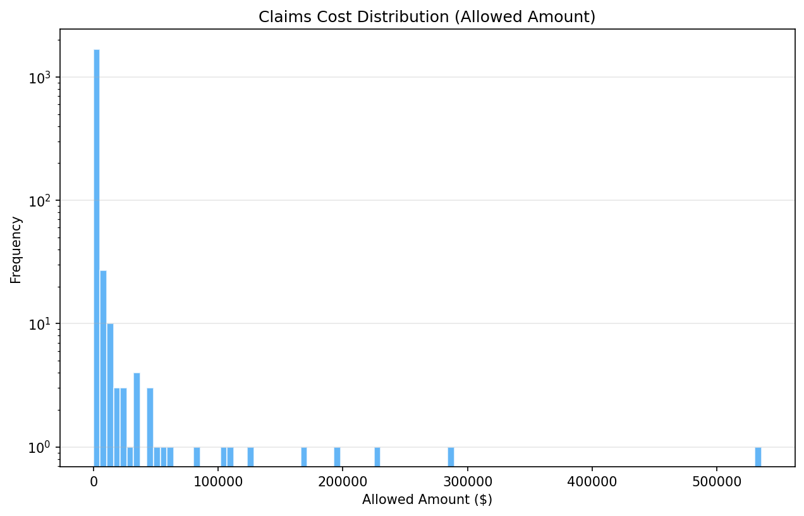
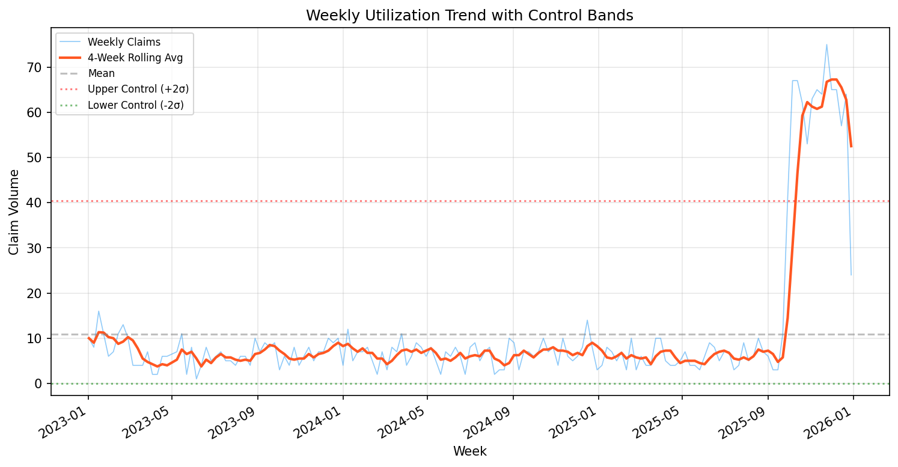
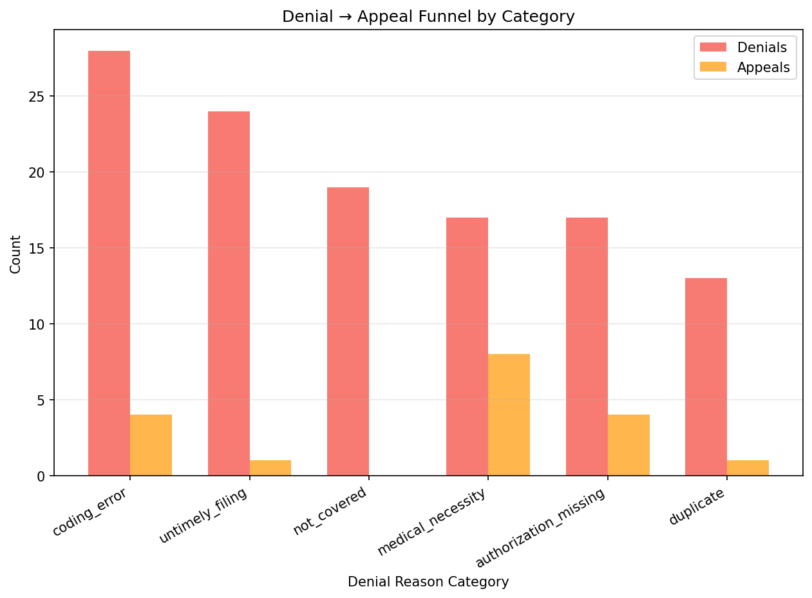

# UM Claims Analytics Report

**Generated:** 2026-02-09 14:38:46

**Seed:** 42 | **Claims:** 1,750

---

## Key Metrics

| Metric | Value |
|---|---|
| Total Claims | 1,750 |
| Total Billed | $6,176,558.55 |
| Total Allowed | $3,905,268.99 |
| Overall Denial Rate | 6.74% |
| Overall Appeal Rate | 15.25% |
| OON Rate | 46.06% |
| Total Flags | 12 |

## Cost Distribution

## Utilization Trend

## Top Anomalies (Detection Flags)

Total flags: **12**

- **High severity:** 11
- **Medium severity:** 1

### Top 20 Flags

| # | Rule | Entity | Severity | Actual | Threshold | Description |
|---|---|---|---|---|---|---|
| 1 | high_volume_provider | FRAUD-PROV-0004 | high | 150.00 | 107.60 | Provider FRAUD-PROV-0004 has 150 claims (z-score=3.12, threshold=108) |
| 2 | high_volume_provider | FRAUD-PROV-0002 | high | 150.00 | 107.60 | Provider FRAUD-PROV-0002 has 150 claims (z-score=3.12, threshold=108) |
| 3 | high_volume_provider | FRAUD-PROV-0001 | high | 150.00 | 107.60 | Provider FRAUD-PROV-0001 has 150 claims (z-score=3.12, threshold=108) |
| 4 | high_volume_provider | FRAUD-PROV-0000 | high | 150.00 | 107.60 | Provider FRAUD-PROV-0000 has 150 claims (z-score=3.12, threshold=108) |
| 5 | high_volume_provider | FRAUD-PROV-0003 | high | 150.00 | 107.60 | Provider FRAUD-PROV-0003 has 150 claims (z-score=3.12, threshold=108) |
| 6 | high_cost_provider | PROV-000008 | high | 539067.71 | 265567.96 | Provider PROV-000008 has $539,067.71 total allowed (z-score=4.81, threshold=$265,568) |
| 7 | new_entity_high_volume | FRAUD-PROV-0004 | high | 150.00 | 25.00 | New provider FRAUD-PROV-0004 (age=88d) has 150 claims, exceeding the 90th percentile of established providers (25) |
| 8 | new_entity_high_volume | FRAUD-PROV-0002 | high | 150.00 | 25.00 | New provider FRAUD-PROV-0002 (age=89d) has 150 claims, exceeding the 90th percentile of established providers (25) |
| 9 | new_entity_high_volume | FRAUD-PROV-0001 | high | 150.00 | 25.00 | New provider FRAUD-PROV-0001 (age=89d) has 150 claims, exceeding the 90th percentile of established providers (25) |
| 10 | new_entity_high_volume | FRAUD-PROV-0000 | high | 150.00 | 25.00 | New provider FRAUD-PROV-0000 (age=89d) has 150 claims, exceeding the 90th percentile of established providers (25) |
| 11 | new_entity_high_volume | FRAUD-PROV-0003 | high | 150.00 | 25.00 | New provider FRAUD-PROV-0003 (age=88d) has 150 claims, exceeding the 90th percentile of established providers (25) |
| 12 | high_cost_provider | PROV-000001 | medium | 293362.64 | 265567.96 | Provider PROV-000001 has $293,362.64 total allowed (z-score=2.29, threshold=$265,568) |

## Policy Impact Analysis

### POL-001: Removed prior auth requirement for imaging services

**Effective Date:** 2024-07-01

| Metric | Pre | Post | Change |
|---|---|---|---|
| Volume | 12 | 15 | +25.0% |
| Total Allowed | $5,455.33 | $292,821.28 | +5267.6% |
| Denial Rate | 16.67% | 13.33% | -0.0333 |
| OON Rate | 0.00% | 6.67% | +0.0667 |

⚠️ **Rebound Detected:** Post-removal volume (15) is 125% of pre-removal volume (12). Utilization did not decrease as expected.

## Appeals & Grievances

| Metric | Value |
|---|---|
| Total Denials | 118 |
| Total Appeals | 18 |
| Total Grievances | 26 |
| Appeal Rate (of denials) | 15.25% |
| Est. Admin Cost | $6,300.00 |

### Top Denial Categories

| Category | Denials | Appeals | Appeal Rate | Billed |
|---|---|---|---|---|
| coding_error | 28 | 4 | 14.29% | $19,277.82 |
| untimely_filing | 24 | 1 | 4.17% | $192,888.12 |
| not_covered | 19 | 0 | 0.00% | $6,564.74 |
| medical_necessity | 17 | 8 | 47.06% | $25,610.56 |
| authorization_missing | 17 | 4 | 23.53% | $14,845.98 |

## Benchmarking vs Peer Baselines

| Metric | Internal | Baseline | Variance | Threshold | Status |
|---|---|---|---|---|---|
| denial_rate | 0.0674 | 0.0800 | -15.75% | ±15% | ⚠️ FLAGGED |
| oon_rate | 0.4606 | 0.0500 | +821.20% | ±20% | ⚠️ FLAGGED |
| cost_per_claim | 2231.5800 | 1200.0000 | +85.96% | ±10% | ⚠️ FLAGGED |

**Flagged metrics:** 3

## Recommended Next Questions

1. **High-severity flags**: Review the top anomalies — are flagged suppliers known entities, or do they warrant SIU investigation?
2. **Policy rebound**: If a rebound was detected, consider whether the policy removal was premature or if utilization is within expected bounds.
3. **Appeal burden**: Which denial categories have the highest appeal rates? Could pre-service review reduce post-service denials?
4. **OON exposure**: Are OON DME clusters concentrated geographically? Consider network adequacy analysis.
5. **Benchmark variance**: For metrics flagged above, drill into the underlying claims to understand whether variance is clinically justified.
